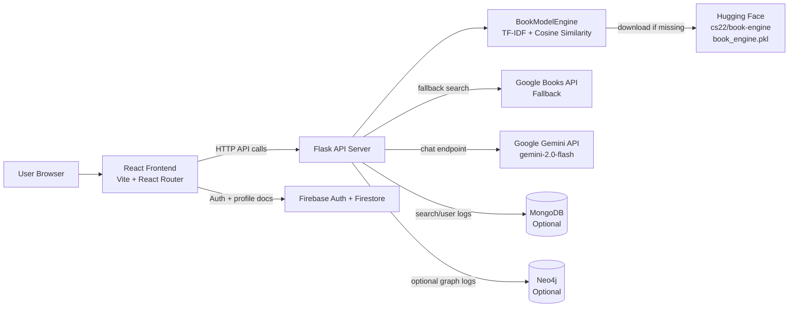
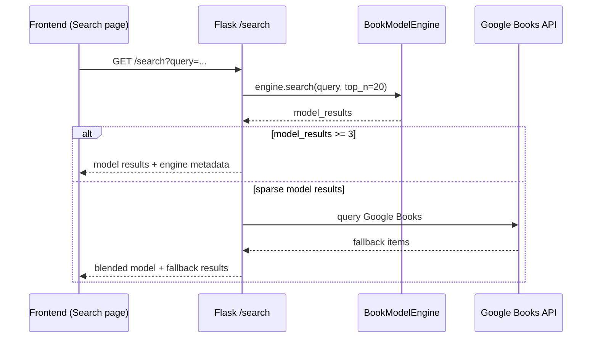

# PageMatch

PageMatch is a full-stack book discovery platform with:
- a React + Vite frontend for search, browsing, and profile-driven interaction,
- a Flask backend that serves recommendation/search APIs,
- a hybrid recommendation engine built from a serialized Hugging Face model,
- optional Gemini chat support and optional MongoDB/Neo4j logging.

## What this project does

- Lets users explore books, manga, and curated clusters.
- Uses a **hybrid retrieval pipeline** (exact matches + TF-IDF semantic matching + pairwise cosine similarity).
- Re-ranks and formats results for UI consumption.
- Falls back to Google Books when model matches are sparse.
- Tracks user interaction locally to adapt recommendation context in real time.

---

## Architecture

### High-level system architecture



### Request/data flow for search



### Backend module layout

```text
server/
  app.py                        # Flask app bootstrap + blueprint registration
  wsgi.py                       # WSGI entrypoint (Gunicorn/Render)
  app/
    routes/
      search.py                 # search, similar-books, featured-book, catalog APIs
      home_recommendations.py   # curated homepage clusters
      user.py                   # username checks and user creation/updates
      gemini_chat.py            # Gemini chat + local chat history
    utils/
      model_engine.py           # model loading + hybrid recommendation logic
    db/
      mongo.py                  # MongoDB connection helper
      neo4j_client.py           # optional Neo4j logging
      homepage_neo4j.py         # optional homepage rec source via Neo4j
  datasets/
    bookwise_homepage_recs.json # fallback dataset
```

---

## Models used

### 1) Primary recommendation model: `cs22/book-engine`
- Loaded from: `server/datasets/book_engine.pkl`.
- If missing locally, downloaded from Hugging Face:
  - `https://huggingface.co/cs22/book-engine/resolve/main/book_engine.pkl`
- Loaded artifacts include:
  - `data` dataframe,
  - `tfidf` vectorizer,
  - `cosine_sim` pairwise similarity matrix,
  - optional `metadata`.

### 2) Retrieval / ranking strategy
The backend combines several strategies in order:
1. exact title match,
2. author match,
3. category match,
4. TF-IDF query vector + cosine similarity over catalog,
5. combined feature substring matching,
6. keyword overlap matching,
7. pairwise cosine expansion for related books.

When nothing scores well, it falls back to popular/high-rated catalog items.

### 3) LLM model for chat
- Endpoint: `/api/gemini-chat`
- Model: `gemini-2.0-flash`
- Provider: Google Generative Language API
- Used for conversational responses; independent of the recommendation model.

---

## Frontend architecture

- Framework: React 19 with React Router.
- Build tool: Vite.
- API clients: `fetch` + `axios`.
- State: local component state + `localStorage` for interaction history/profile context.
- Major pages:
  - `Login` (Firebase auth flows),
  - `Home` (featured + dynamic recommendations),
  - `Search` (query results + similar books modal),
  - `Books` and `Manga` (catalog clusters),
  - `Profile` / `Settings` (client-managed preferences).

---

## API overview

### Search and recommendation APIs
- `POST /log-search`
- `GET /search?query=<q>&category=<optional>`
- `POST /search-books`
- `GET /similar-books?book=<title>`
- `GET /featured-book`
- `GET /catalog/books`
- `GET /catalog/manga`
- `GET /reading-pipeline`
- `GET /homepage-recommendations`

### User APIs
- `POST /check-username`
- `POST /create-user`
- `POST /update-username`

### Gemini APIs
- `POST /api/gemini-chat`
- `GET /api/history`

---

## Setup

## 1) Prerequisites
- Node.js 18+
- Python 3.10+
- Optional: MongoDB, Neo4j
- Optional (for chat): Gemini API key

## 2) Clone and install

```bash
# frontend
cd /home/runner/work/pagematch2/pagematch2/frontend
npm install

# backend
cd /home/runner/work/pagematch2/pagematch2/server
python -m venv .venv
source .venv/bin/activate   # Windows: .venv\Scripts\activate
pip install -r requirements.txt
```

## 3) Environment variables (backend)
Create `/home/runner/work/pagematch2/pagematch2/server/.env`:

```env
PORT=5001
GEMINI_API_KEY=your_key_here
MONGO_URI=mongodb://localhost:27017/bookwise
NEO4J_URI=bolt://localhost:7687
NEO4J_USER=neo4j
NEO4J_PASSWORD=your_password
NEO4J_DB=pagedbms
```

## 4) Run the app

```bash
# run backend
cd /home/runner/work/pagematch2/pagematch2/server
python app.py

# run frontend
cd /home/runner/work/pagematch2/pagematch2/frontend
npm run dev
```

Default frontend dev URL is usually `http://localhost:5173` and backend default is `http://localhost:5001`.

---

## Tech stack

- **Frontend:** React, Vite, React Router, Axios, Firebase SDK, React Icons
- **Backend:** Flask, Flask-CORS, Requests
- **ML/Data:** scikit-learn, NumPy, Pandas, SciPy
- **Storage/Graph (optional):** MongoDB (PyMongo), Neo4j
- **LLM:** Gemini 2.0 Flash

---

## Notes

- Large model binaries (`*.pkl`) are git-ignored and fetched at runtime when absent.
- MongoDB and Neo4j integrations are optional; core recommendation/search still functions without them.
- Search quality depends on the serialized `book_engine.pkl` artifacts and metadata quality in its catalog.
